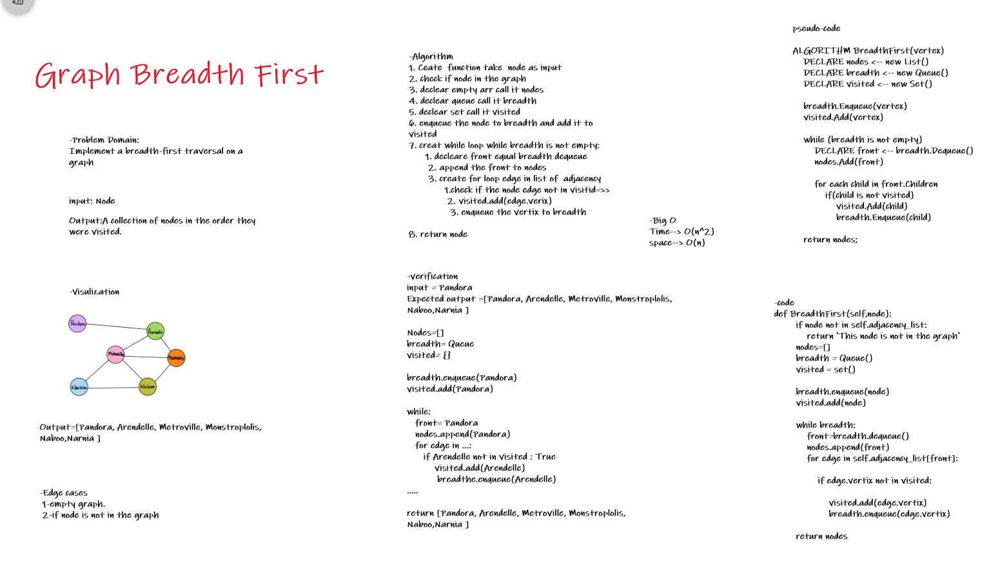

# Breadth-First Traversal of a Graph

# Challenge Summary

Write the following method for the Graph class:

* breadth first
    * Arguments: Node
    * Return: A collection of nodes in the order they were visited.
    * Display the collection

## Whiteboard Process



## Approach & Efficiency

1. Ceate  function take  node as input
2. check if node in the graph
3. declear empty arr call it nodes
4. declear queue call it breadth
5. declear set call it visited
6. enqueue the node to breadth and add it to visited
7. creat while loop while breadth is not empty:
    1. decleare front equal breadth dequeue
    2. append the front to nodes
    3. create for loop edge in list of  adjacency
        1. check if the node edge not in visitid=>>
        2. visited.add(edge.verix)
        3. enqueue the vertix to breadth

8. return node


* Time--> O(n^2)
* space--> O(n)

## Solution
```
input = Pandora
Expected output =[Pandora, Arendelle, Metroville, Monstroplolis, Naboo,Narnia ]

Nodes=[]
breadth= Queue
visited= {}

breadth.enqueue(Pandora)
visited.add(Pandora)

while:
   front= Pandora
   nodes.append(Pandora)
   for edge in ...:
      if Arendelle not in visited : True
          visited.add(Arendelle)
           breadthe.enqueue(Arendelle)
.....

return [Pandora, Arendelle, Metroville, Monstroplolis, Naboo,Narnia ]
```