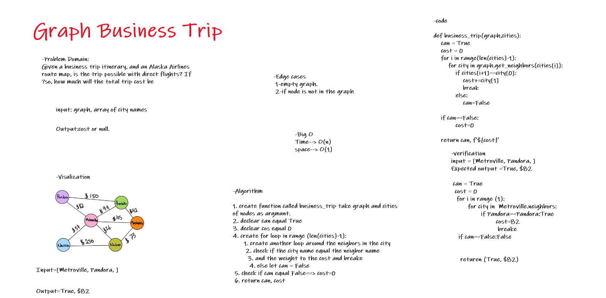

# Graph Business Trip


Given a business trip itinerary, and an Alaska Airlines route map, is the trip possible with direct flights? If so, how much will the total trip cost be.

# Challenge Summary


Write a function called business trip

Arguments: graph, array of city names

Return: cost or null


## Whiteboard Process



## Approach & Efficiency

1. create function called business_trip take graph and cities of nodes as argmunt.
2. declear can equal True
3. declear cos equal 0
4. create for loop in range (len(cities)-1):
    1. create another loop around the neigbors in the city
    2. check if the city name equal the neigbor name
    3. and the weight to the cost and breake
    4. else let can = False
 5. check if can equal False==> cost=0
 6. return can, cost


* Time--> O(n)
* space--> O(1)


## Solution

```
input = [Metroville, Pandora, ]
Expected output =True, $82

 can = True
  cost = 0
   for i in range (1):
         for city in  Metroville.neighbors:
                if Pandora==Pandora:True
                        cost=82
                         breake 
    if can==False:False
     

     returen (True, $82)
     
```
