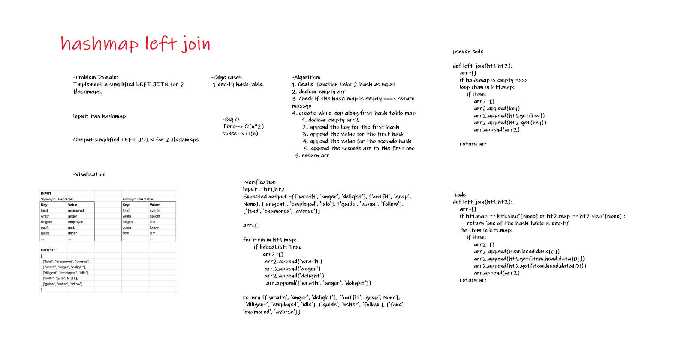

# Hashmap LEFT JOIN

# Challenge Summary
function called left join

Arguments: two hash maps

Implement a simplified LEFT JOIN for 2 Hashmaps

## Whiteboard Process



## Approach & Efficiency

1. Ceate  function take 2 hash as input
2. declear empty arr
3. check if the hash map is empty ===> return massge
4. create while loop along first hash table map
    1. declear empty arr2
    2. append the key for the first hash
    3. append the value for the first hash
    4. append the value for the seconde hash
    5. append the seconde arr to the first one
5. return arr 

* Time--> O(n^2)
* space--> O(n)

## Solution
```
input = ht1,ht2
Expected output =[['wrath', 'anger', 'delight'], ['outfit', 'grap', None], ['diligent', 'employed', 'idle'], ['guide', 'usher', 'follow'], ['fond', 'enamored', 'averse']]

arr=[]

for item in ht1.map:
      if linkedList: True
           arr2=[]
            arr2.append('wrath')
            arr.2append('anger')
            arr2.append('delight')
             arr.append(['wrath', 'anger', 'delight'])

return [['wrath', 'anger', 'delight'], ['outfit', 'grap', None], ['diligent', 'employed', 'idle'], ['guide', 'usher', 'follow'], ['fond', 'enamored', 'averse']]
```