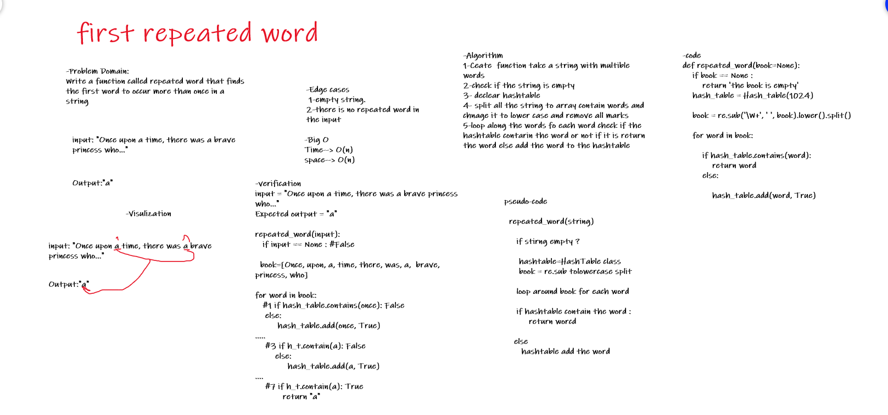

# Challenge Summary
Write a function called repeated word that finds the first word to occur more than once in a string

## Whiteboard Process



## Approach & Efficiency

1. Ceate  function take a string with multible words
2. check if the string is empty
3. declear hashtable 
4. split all the string to array contain words and chnage it to lower case and remove all marks 
5. loop along the words fo each word check if the hashtable contarin the word or not if it is return the word else add the word to the hashtable

### Big O :

* Time--> O(n)
* space--> O(n)

## Solution

```
input = "Once upon a time, there was a brave princess who..."
Expected output = "a"

repeated_word(input):
   if input == None : #False

  book=[Once, upon, a, time, there, was, a,  brave, princess, who]

for word in book:
   #1 if hash_table.contains(once): False
    else: 
         hash_table.add(once, True)
.....
    #3 if h_t.contain(a): False
        else:
             hash_table.add(a, True)
....
    #7 if h_t.contain(a): True
           return "a"
```
