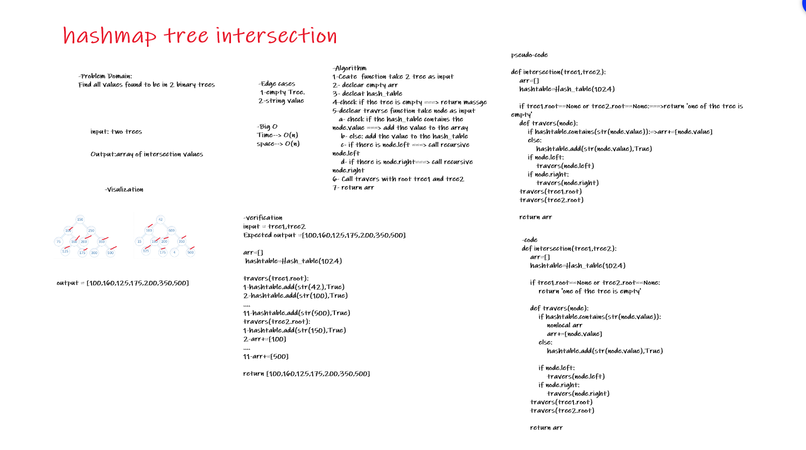

# Challenge Summary
Find all values found to be in 2 binary trees

## Whiteboard Process


## Approach & Efficiency
1. Ceate  function take 2 tree as input
2. declear empty arr
3. decleat hash_table
4. check if the tree is empty ===> return massge
5. declear travrse function take node as input
    1. check if the hash_table contains the node.value ===> add the value to the array
    2. else: add the value to the hash_table
    3. if there is node.left ===> call recursive node.left
    4. if there is node.right===> call recursive node.right
6. Call travers with root tree1 and tree2
7. return arr

### Big O :

* Time--> O(n)
* space--> O(n)

## Solution
```
-verification
input = tree1,tree2
Expected output =[100,160,125,175,200,350,500]

arr=[]
 hashtable=Hash_table(1024)

travers(tree1.root):
1-hashtable.add(str(42),True)
2-hashtable.add(str(100),True)
....
11-hashtable.add(str(500),True)
travers(tree2.root):
1-hashtable.add(str(150),True)
2-arr+=[100]
....
11-arr+=[500]

return [100,160,125,175,200,350,500]
```