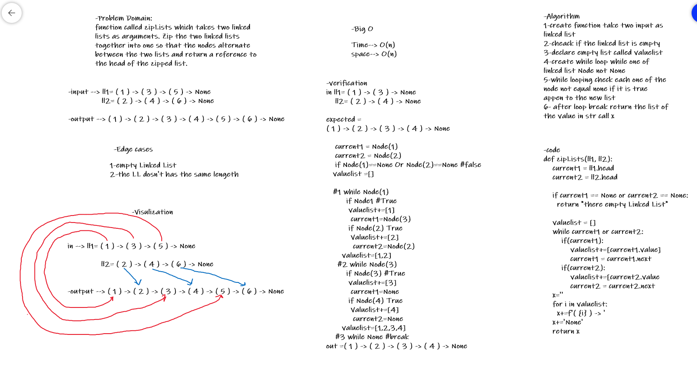

# Challenge Summary
function called zipLists which takes two linked lists as arguments. Zip the two linked lists together into one so that the nodes alternate between the two lists and return a reference to the head of the zipped list

## Whiteboard Process



## Approach & Efficiency
create function take two input as linked list, cheack if the linked list is empty, declare empty list called valuelist, create while loop while one of linked list Node not None, while looping check each one of the node not equal none if it is true appen to the new list, after loop break return the list of the value in str call x

### Big O

Time--> O(n)

space--> O(n)


## Solution

```
in ll1= ( 1 ) -> ( 3 ) -> None
    ll2= ( 2 ) -> ( 4 ) -> None

expected = 
( 1 ) -> ( 2 ) -> ( 3 ) -> ( 4 ) -> None

    current1 = Node(1)
    current2 = Node(2)
    if Node(1)==None Or Node(2)==None #false
   valuelist =[]
    
   #1 while Node(1)
         if Node1 #True
          valuelist+=[1]
           current1=Node(3)
          if Node(2) True
           Valuelist+=[2]
            current2=Node(2)
       valuelist=[1,2]
     #2 while Node(3)
         if Node(3) #True
          valuelist+=[3]
           current1=None
          if Node(4) True
           Valuelist+=[4]
            current2=None
       valuelist=[1,2,3,4]
    #3 while None #break
out =( 1 ) -> ( 2 ) -> ( 3 ) -> ( 4 ) -> None
```
