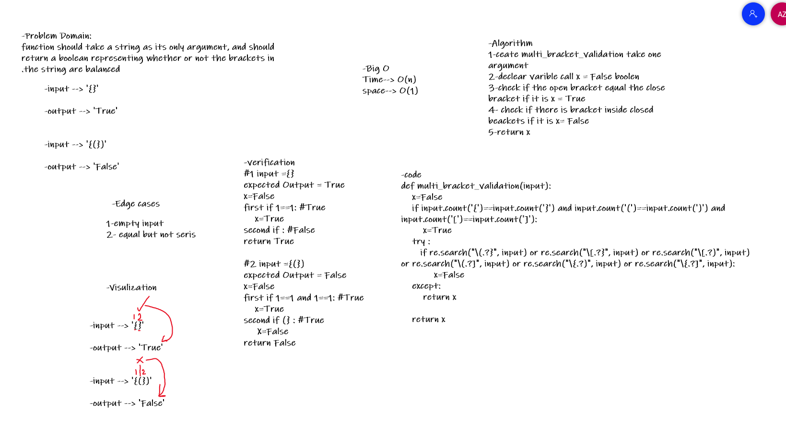

# Challenge Summary
function should take a string as its only argument, and should return a boolean representing whether or not the brackets in the string are balanced.

## Whiteboard Process



## Approach & Efficiency

Ceate multi_bracket_validation take one argument, declear varible call x = False boolen, check if the open bracket equal the close bracket if it is x = True, check if there is bracket inside closed beackets if it is x= False, return x.

Big O :
* time : O(1)
* space : O(1)

## Solution

```
#1 input ={}
expected Output = True
x=False 
first if 1==1: #True
    x=True
second if : #False 
return True

#2 input ={(})
expected Output = False
x=False 
first if 1==1 and 1==1: #True
    x=True
second if (} : #True
     X=False
return False
```
