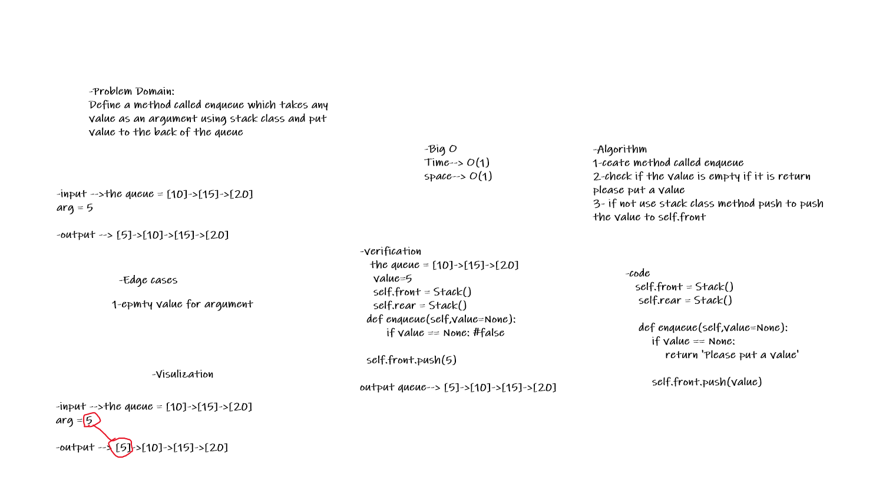
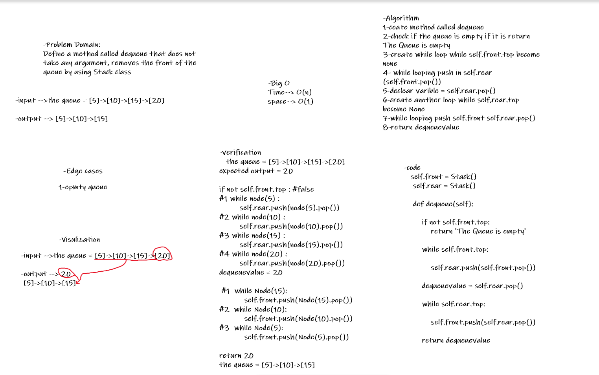

# Challenge Summary
Create a brand new PseudoQueue class. Do not use an existing Queue. Instead, this PseudoQueue class will implement our standard queue interface.

enqueue(value) which inserts value into the PseudoQueue, using a first-in, first-out approach.

dequeue() which extracts a value from the PseudoQueue, using a first-in, first-out approach.

## Whiteboard Process

### enqueue




### dequeue




## Approach & Efficiency

### enqueue

Ceate method called enqueue, check if the value is empty if it is return 
please put a value, if not use stack class method push to push 
the value to self.front

Big O :
* time : O(1)
* space : O(1)

### dequeue

Ceate method called dequeue, check if the queue is empty if it is return The Queue is empty, create while loop while self.front.top become none, while looping push in self.rear (self.front.pop()), declear varible = self.rear.pop(), create another loop while self,rear.top become None , while looping push self.front self.rear.pop(), return dequeuevalue


Big O :
* time : O(n)
* space : O(1)

## Solution

### enqueue

```
-verification
   the queue = [10]->[15]->[20]
    value=5
    self.front = Stack()
    self.rear = Stack()
  def enqueue(self,value=None):
        if value == None: #false
   
  self.front.push(5)

output queue--> [5]->[10]->[15]->[20]
```

### dequeue

```
-verification
   the queue = [5]->[10]->[15]->[20]
expected output = 20

if not self.front.top : #false
#1 while node(5) :
         self.rear.push(node(5).pop())
#2 while node(10) :
         self.rear.push(node(10).pop())
#3 while node(15) :
         self.rear.push(node(15).pop())
#4 while node(20) :
         self.rear.push(node(20).pop())
dequeuevalue = 20

 #1  while Node(15):
           self.front.push(Node(15).pop())
#2  while Node(10):
           self.front.push(Node(10).pop())
#3  while Node(5):
           self.front.push(Node(5).pop())

return 20
the queue = [5]->[10]->[15]
```
