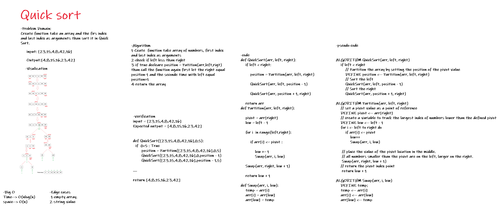

# Challenge Summary
Create function take an array and the firs index and last index as arguments than sort it in Quick Sort.

## Whiteboard Process


## Approach & Efficiency
1. Ceate  function take array of numbers, first index and last index as arguments
2. check if left less than right
3. if true decleare position = Patition(arr,left,rigt)
than call the function again first let the right equal
position-1 and the seconde time with left equal position+1
4-return the array


### Big O :
* Time--> O(n^2)
* space--> O(log(n))


## Solution
```
input = [23,15,4,8,42,16]
Expected output = [4,8,15,16,23,42]


def QuickSort([23,15,4,8,42,16],0,5):
  if  0<5 : True
       position = Partition([23,15,4,8,42,16],0,5)
       QuickSort([23,15,4,8,42,16],0,position - 1)
       QuickSort([23,15,4,8,42,16],position - 1,5)
   
....

return [4,8,15,16,23,42]

```
