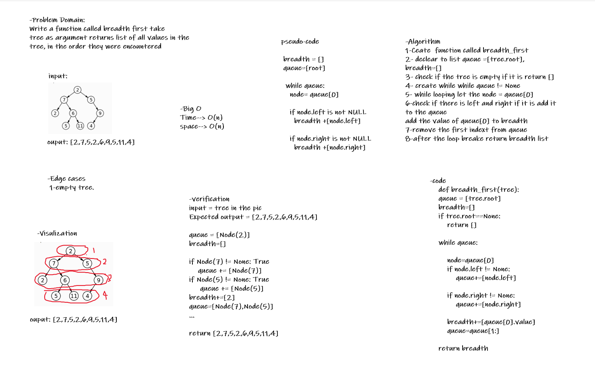

# Challenge Summary
Write a function called breadth first :
* Arguments: tree
* Returns: list of all values in the tree, in the order they were encountered

## Whiteboard Process



## Approach & Efficiency

1. Ceate  function called breadth_first
2. declear to list queue =[tree.root], breadth=[]
3. check if the tree is empty if it is return []
4. create while while queue != None
5. while looping let the node = queue[0]
6. check if there is left and right if it is add it to the queue
add the value of queue[0] to breadth
7. remove the first indext from queue
8. after the loop breake return breadth list

### Big O :
* Time--> O(n)
* space--> O(n)

## Solution

```
input = tree in the pic
Expected output = [2,7,5,2,6,9,5,11,4]

queue = [Node(2)]
breadth=[]

if Node(7) != None: True
    queue += [Node(7)]
if Node(5) != None: True
     queue += [Node(5)]
breadth+=[2]
queue=[Node(7),Node(5)]
...

return [2,7,5,2,6,9,5,11,4]
```
