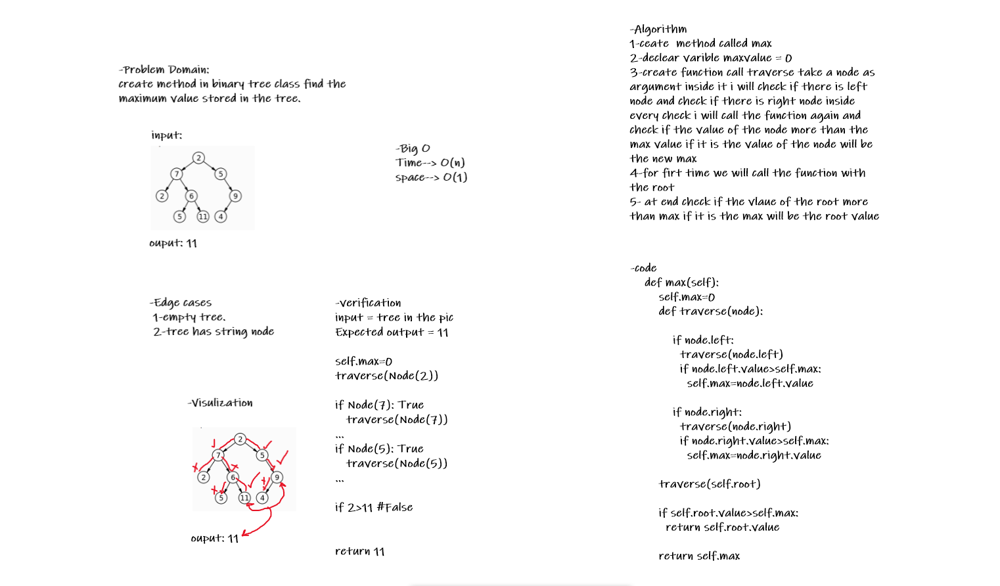

# Challenge Summary
Write method for the Binary Tree class find maximum value :
* Arguments: none
* Returns: number

Find the maximum value stored in the tree. 

## Whiteboard Process



## Approach & Efficiency

Ceate  method called max, call pre_order() method, creat while loop while len(self.treelist)!=1, while looping check if the last two index in the list are string if it is return error massege, check if the last index more than Before last  index if it is remove the before last index, else remove the last index, after loop breake return the 0 index

## Solution
```
input = tree in the pic
Expected output = 11
self.treelist= [2, 7, 2, 6, 5, 11, 5, 9, 4]
#1 while not 10==1: True 
   if int !=int or int !=int : False

if 4>9: False
else :
   self.treelist.remove(4)
self.treelist= [7, 11]
#8 while not 2==1 : True
   if int !=int or int !=int : False
  if 11>7: True
self.treelist.remove(7)

return 11
```
