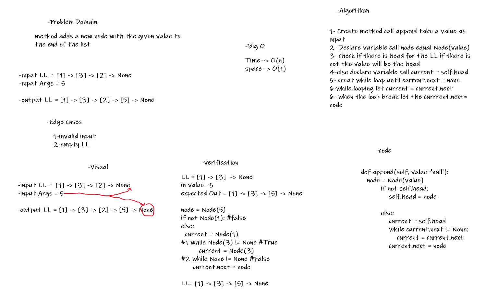
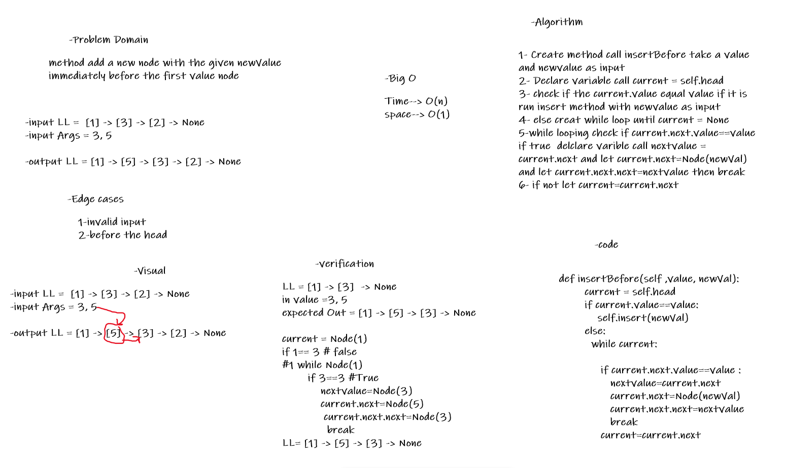

# Singly Linked List
Linked List can be defined as collection of objects called nodes that are randomly stored in the memory.

A node contains two fields i.e. data stored at that particular address and the pointer which contains the address of the next node in the memory.

The last node of the list contains pointer to the null.

## Challenge
Create a Node class that has properties for the value stored in the Node, and a pointer to the next Node. Within the LinkedList class, include a head property. Upon instantiation, an empty Linked List should be created.

## Approach & Efficiency
Node class that has properties for the value stored in the Node, and a pointer to the next Node, LinkedList class, include a head property. Upon instantiation, an empty Linked.

### Efficiency : 
* insert :
  time : O(1)
  space : O(1)
* append :
  time : O(n)
  space : O(1)
* includes :
  time : O(n)
  space : O(1)
* __ str __
  time : O(n)
  space : O(n)
* insertBefore :
  time : O(n)
  space : O(1)
* insertAfter :
  time : O(n)
  space : O(1)
* kthFromEnd :
  time : O(n)
  space : O(n)

  
## Whiteboard Process
### append

### insertBefore

### insertAfter

### kthFromEnd

## API
### insert
Takes any value as an argument and adds a new node with that value to the head of the list.
### includes 
Takes any value as an argument and returns a boolean result depending on whether that value exists as a Node’s value somewhere within the list.
### append
Takes any value as an argument and adds a new node with that value to the end of the list.
### insertBefore
Add a new node with the given newValue immediately before the first value node
### insertAfter
Add a new node with the given newValue immediately after the first value node
### kthFromEnd
Takes a number, k, as a parameter. Return the node’s value that is k from the end of the linked list.
### __str__
Takes in no arguments and returns a string representing all the values in the Linked List, formatted as:

    { a } -> { b } -> { c } -> NULL

